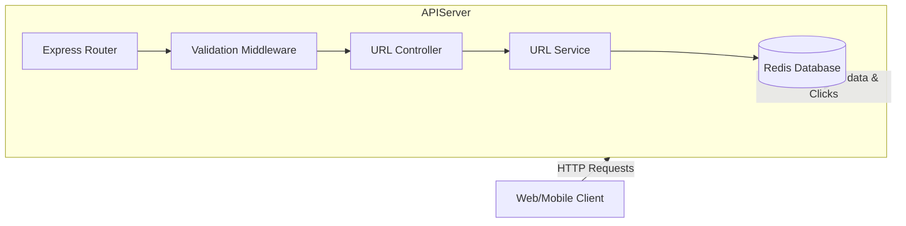

# My URL Shortener API

This project gives you a simple, fast way to create short, shareable links from long URLs. You can shorten any URL, and it'll give you back a compact slug that redirects to your original link. Plus, it keeps track of how many times each short URL gets clicked, so you get basic insights into its usage.

## Installation

Let's get this project up and running on your local machine.

1.  **Clone the Repository**

    ```bash
    git clone https://github.com/Nelsonnxx4/my-url-shortener-api.git
    cd my-url-shortener-api
    ```

2.  **Install Dependencies**

    ```bash
    npm install
    # or yarn install
    ```

3.  **Set Up Environment Variables**

    Create a `.env` file in the root directory of the project and add the following variables. These are crucial for the application to connect to Redis and generate correct short URLs.

    ```dotenv
    PORT=3000
    BASE_URL=http://localhost:3000 # Or your deployed domain
    REDIS_URL=redis://localhost:6379 # Your Redis connection string
    ```

4.  **Start the Server**

    To start the server in development mode (with `nodemon` for auto-reloading):

    ```bash
    npm run dev
    ```

    For a production build:

    ```bash
    npm run build
    npm start
    ```

## Usage

Once the server is running, you can interact with the API endpoints to shorten URLs, redirect to original URLs, and fetch stats.

### Shorten a URL

Send a `POST` request to the `/shorten` endpoint with the URL you want to shorten in the request body.

```bash
curl -X POST -H "Content-Type: application/json" -d '{"url": "https://www.example.com/very/long/url/that/needs/shortening"}' http://localhost:3000/shorten
```

This will return a short URL like `http://localhost:3000/your_short_slug`.

### Redirect to Original URL

Open your browser or use `curl` to visit a shortened URL. The API will redirect you to the original destination.

```bash
curl -L http://localhost:3000/your_short_slug
```

### Get URL Statistics

To see how many times a short URL has been clicked, send a `GET` request to the `/:slug/stats` endpoint.

```bash
curl http://localhost:3000/your_short_slug/stats
```

## Features

Here are some of the key things this URL shortener can do:

- **URL Shortening**: Takes a long URL and generates a unique, short slug. This slug is stored with the original URL in Redis with a time-to-live (TTL).

  ```mermaid
  sequenceDiagram
    actor User
    participant "API Server" as Server
    participant "Redis Database" as Redis

    User->>Server: POST /shorten (url)
    Server->>Server: Validate URL
    Server->>Server: Generate unique slug (nanoid)
    Server->>Redis: SET slug:originalUrl (with TTL)
    Redis-->>Server: OK
    Server-->>User: 201 Created (shortUrl, slug)
  ```

- **URL Redirection**: When a user accesses a short URL, the service retrieves the original URL from Redis and redirects the user. It also increments a click counter for that short URL.

  ```mermaid
  sequenceDiagram
    actor User
    participant "API Server" as Server
    participant "Redis Database" as Redis

    User->>Server: GET /:slug
    Server->>Redis: GET slug
    Redis-->>Server: Returns originalUrl (or null)
    alt Original URL Found
      Server->>Redis: INCR stats:slug
      Redis-->>Server: Returns new click count
      Server-->>User: 301 Redirect to originalUrl
    else URL Not Found
      Server-->>User: 404 Not Found
    end
  ```

- **Click Tracking**: Each time a short URL is accessed, a dedicated counter for that slug is incremented in Redis, allowing you to track its usage.

- **URL Validation**: Before shortening, the API performs basic validation to ensure the provided input is a valid URL format.

## System Architecture / Design

This project follows a straightforward service-oriented architecture, leveraging a lightweight Express API and Redis for high-speed data storage.



## Technologies Used

| Technology     | Description                                            |
| :------------- | :----------------------------------------------------- |
| **Node.js**    | JavaScript runtime for the backend.                    |
| **Express.js** | Fast, unopinionated, minimalist web framework.         |
| **TypeScript** | Superset of JavaScript for type-safe development.      |
| **Redis**      | In-memory data store used for URL mapping & stats.     |
| **nanoid**     | Tiny, secure, URL-friendly unique string ID generator. |
| **dotenv**     | Loads environment variables from a `.env` file.        |

## API Documentation

This section details the available API endpoints for the URL Shortener.

---

#### `POST /shorten`

**Description**: Creates a new short URL for a given long URL.

**Request**:

```json
{
	"url": "https://www.example.com/a-very-long-and-descriptive-path-to-a-resource"
}
```

**Response**:

```json
{
	"shortUrl": "http://localhost:3000/your_generated_slug",
	"slug": "your_generated_slug"
}
```

**Errors**:

- `400 Bad Request`: If the `url` is missing or has an invalid format.
- `500 Internal Server Error`: If there's an issue with shortening the URL (e.g., Redis connection error).

---

#### `GET /:slug`

**Description**: Redirects to the original long URL associated with the provided short slug and increments its click count.

**Request**:
(No request body needed, `slug` is in path)

**Response**:

- `301 Moved Permanently`: Redirects to the `originalUrl`.

**Errors**:

- `404 Not Found`: If the `slug` does not exist or has expired.
- `500 Internal Server Error`: If there's an issue with the redirect process.

---

#### `GET /:slug/stats`

**Description**: Retrieves the original URL and the total click count for a given short slug.

**Request**:
(No request body needed, `slug` is in path)

**Response**:

```json
{
	"slug": "your_generated_slug",
	"original": "https://www.example.com/a-very-long-and-descriptive-path-to-a-resource",
	"clicks": 15
}
```

**Errors**:

- `404 Not Found`: If the `slug` does not exist.
- `500 Internal Server Error`: If there's an issue retrieving the stats from Redis.

---

### Environment Variables

The application relies on the following environment variables:

| Variable    | Description                                 | Example                                              |
| :---------- | :------------------------------------------ | :--------------------------------------------------- |
| `PORT`      | The port the Express server will listen on. | `3000`                                               |
| `BASE_URL`  | The base URL for generating short links.    | `http://localhost:3000` or `https://myshortener.com` |
| `REDIS_URL` | Connection string for the Redis server.     | `redis://localhost:6379`                             |

## License

This project is licensed under the ISC License.

## Author Info

- **LinkedIn**: [Nelson .](https://linkedin.com/in/nelsonnxx4)
- **X (Twitter)**: [Nelson](https://x.com/nelsonnxx4)

---

[](https://nodejs.org/)
[](https://www.typescriptlang.org/)
[](https://expressjs.com/)
[](https://redis.io/)

[](https://www.npmjs.com/package/dokugen)
